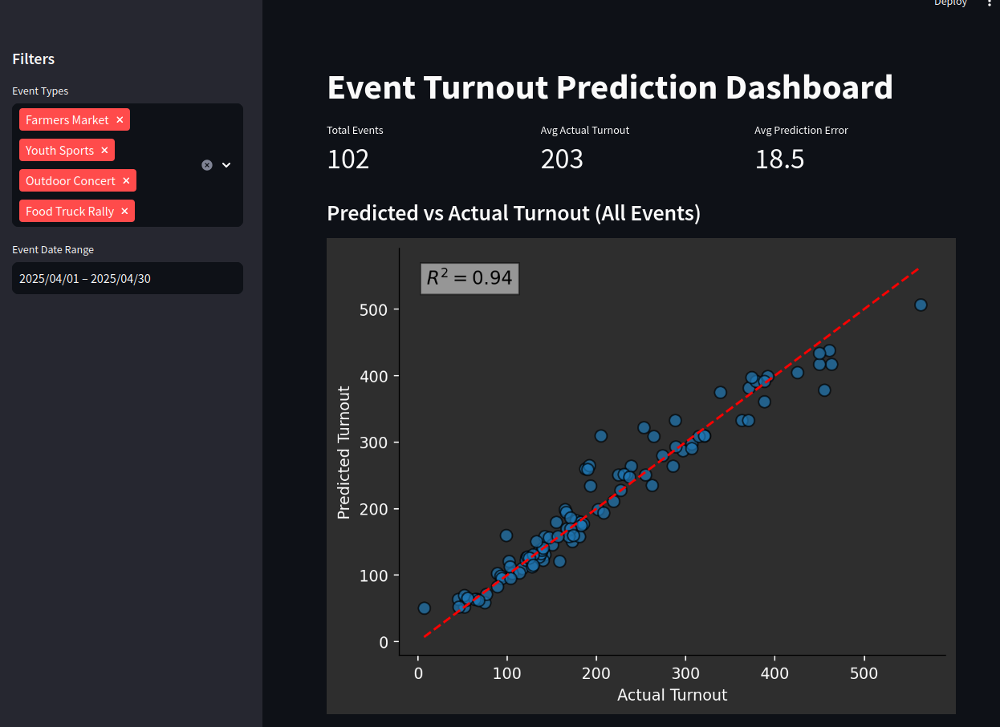

# Event Turnout Prediction Dashboard

An interactive dashboard that predicts and visualizes **event attendance** based on **weather forecasts** and **event metadata**.

### Built Using:
- **PostgreSQL** for data storage
- **OpenWeatherMap API** for weather forecasting
- **scikit-learn** for machine learning (Random Forest model)
- **Streamlit** for interactive visualization
- **Altair** & **Seaborn** for enhanced charting and plots

 <!-- Replace with an actual screenshot path -->

---

## Project Overview

This project simulates local events (e.g., outdoor concerts, farmers markets), fetches weather forecasts for them, and predicts expected turnout using a trained machine learning model.

It includes:
- Synthetic event + weather generation
- Integration with the OpenWeatherMap API
- Random forest model to predict turnout
- Dashboard to explore predictions vs actual turnout

---

## Features

- Interactive filters for event type and date
- Weather impact visualizations (temperature, rain probability, cloud coverage)
- Real-time model predictions and error comparison
- Dynamic color schemes for event types across the dashboard
- Clean layout with sidebars and metrics

---

## Future Improvements

- Add live event entry + prediction form
- Deploy to **Streamlit Cloud**
- Model interpretability through SHAP values or feature importance visualization
- Notifications for high-risk, low-turnout weather events

---

## Setup Instructions

### 1. Clone the Repository

```bash
git clone https://github.com/your-username/event-turnout-dashboard.git
cd event-turnout-dashboard
```

### 2. Create personal .env file
Fill with the following information. Make sure gitignore is set to not track anything personal.
This is **sql.env** for me when my python functions in this repo call for it.
```
DB_HOST=localhost
DB_NAME=event_db
DB_USER=event_user
DB_PASS=your_password
OWM_API_KEY=your_openweathermap_api_key
```

### 3. Install Dependencies
```bash
pip install -r requirements.txt
```

### 4. Run Pipeline
```bash
python generate_events.py       # Step 1: Generate synthetic events
python fetch_weather.py         # Step 2: Get weather forecasts
python simulate_turnout.py      # Step 3: Simulate actual turnout
python train_turnout_model.py   # Step 4: Train and save model
python predict_turnout.py       # Step 5: Predict using model
```

### 5. Launch the Dashboard
```bash 
streamlit run dashboard.py
```